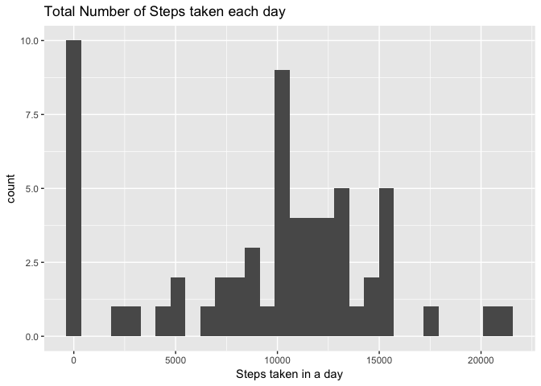
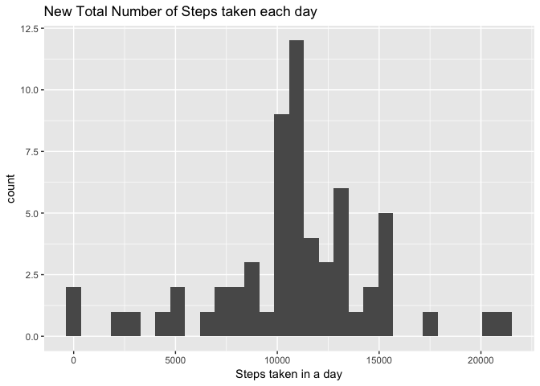
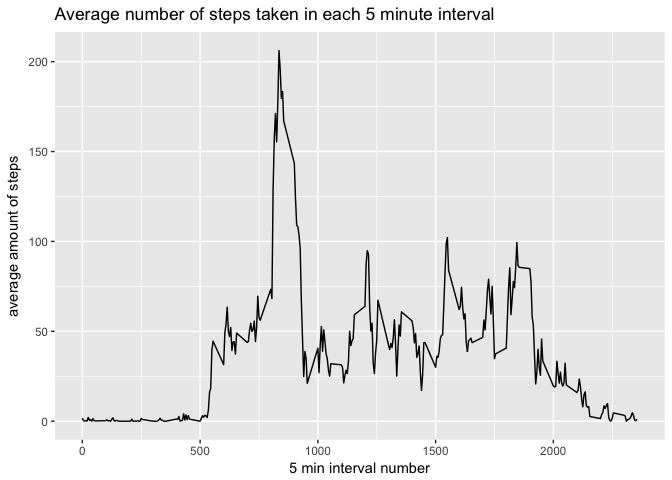

## Loading and preprocessing the data

```r
library(dplyr)
```

```
## 
## Attaching package: 'dplyr'
```

```
## The following objects are masked from 'package:stats':
## 
##     filter, lag
```

```
## The following objects are masked from 'package:base':
## 
##     intersect, setdiff, setequal, union
```

```r
library(ggplot2)
library(lattice)
activity_data <- read.csv("activity.csv", colClasses = c("integer","Date", "integer"))
```

```
## Warning in strptime(xx, f <- "%Y-%m-%d", tz = "GMT"): unknown timezone
## 'default/America/Los_Angeles'
```


## What is mean total number of steps taken per day?

```r
#1. Calculate the total number of steps taken per day
totalNumSteps <- group_by(activity_data, date) %>% summarize(totalSteps = sum(steps, na.rm = TRUE))
totalNumSteps <- as.data.frame(totalNumSteps)
#2. Make a histogram of the total number of steps taken each day
ggplot(data=totalNumSteps, aes(totalNumSteps$totalSteps)) + xlab("Steps taken in a day") + labs(title ="Total Number of Steps taken each day") +  geom_histogram();
```

```
## `stat_bin()` using `bins = 30`. Pick better value with `binwidth`.
```

<!-- -->

```r
#3. Calculate and report the mean and median of the total number of steps taken per day
meanNumberOfStepsTakenPerDay <- mean(totalNumSteps$totalSteps)
medianNumberOfStepsTakenPerDay <-median(totalNumSteps$totalSteps)
meanNumberOfStepsTakenPerDay
```

```
## [1] 9354.23
```

```r
medianNumberOfStepsTakenPerDay
```

```
## [1] 10395
```


## What is the average daily activity pattern?

```r
#1. Make a time series plot (i.e. type="l") of the 5-minute interval (x-axis) and the average 
# number of steps taken, averaged across all days (y-axis)
averageStepsPerInterval <- group_by(activity_data, interval) %>% summarize(averageSteps = mean(steps, na.rm = TRUE))
averageStepsPerInterval <- as.data.frame(averageStepsPerInterval)
ggplot(data = averageStepsPerInterval, aes(x=interval, y=averageSteps)) + xlab("5 min interval number") + ylab("average amount of steps") + labs(title= "Average number of steps taken in each 5 minute interval") + geom_line() 
```

<!-- -->

```r
#2. Which 5-minute interval, on average across all the days in the dataset, contains 
# the maximum number of steps?
intervalWithMaximumSteps <- averageStepsPerInterval[averageStepsPerInterval$averageSteps == max(averageStepsPerInterval$averageSteps),"interval"]
intervalWithMaximumSteps
```

```
## [1] 835
```


## Imputing missing values

```r
#Note that there are a number of days/intervals where there are missing values 
# (coded as NA). The presence of missing days may introduce bias into some calculations 
# or summaries of the data.

#1. Calculate and report the total number of missing values in the dataset 
# (i.e. the total number of rows with NAs)
numberOfMissingValues <- sum(is.na(activity_data))
#2. Devise a strategy for filling in all of the missing values in the dataset. The 
# strategy does not need to be sophisticated. For example, you could use the mean/median
# for that day, or the mean for that 5-minute interval, etc.

#calculate the mean number of steps taken in that interval across all days, and use that value to
#replace the NA value
averageStepsPerInterval <- group_by(activity_data, interval) %>% summarize(averageSteps = mean(steps, na.rm = TRUE))
averageStepsPerInterval <- as.data.frame(averageStepsPerInterval)
#3. Create a new dataset that is equal to the original dataset but with the missing data filled in.
replaceNAValues <- function(activity_data, averageStepsPerInterval) {
  for (i in 1:dim(activity_data)[1]) {
    if (is.na(activity_data$steps[i])) {
      activity_data$steps[i] <- averageStepsPerInterval$averageSteps[averageStepsPerInterval$interval == activity_data$interval[i]]
    }
  }
  return(activity_data)
}
newActivity_data <- replaceNAValues(activity_data, averageStepsPerInterval)

#4. Make a histogram of the total number of steps taken each day and Calculate and report the mean
# and median total number of steps taken per day. 
newTotalNumSteps <- group_by(newActivity_data, date) %>% summarize(totalSteps = sum(steps, na.rm = TRUE))
newTotalNumSteps <- as.data.frame(newTotalNumSteps)
ggplot(data=newTotalNumSteps, aes(newTotalNumSteps$totalSteps)) + xlab("Steps taken in a day") + labs(title ="New Total Number of Steps taken each day") +  geom_histogram();
```

```
## `stat_bin()` using `bins = 30`. Pick better value with `binwidth`.
```

<!-- -->

```r
newMeanNumberOfStepsTakenPerDay <- mean(newTotalNumSteps$totalSteps)
newMedianNumberOfStepsTakenPerDay <- median(newTotalNumSteps$totalSteps)
newMeanNumberOfStepsTakenPerDay
```

```
## [1] 10766.19
```

```r
newMedianNumberOfStepsTakenPerDay
```

```
## [1] 10766.19
```

```r
#Do these values differ from the estimates from the first part of the assignment? What is the impact 
#of imputing missing data on the estimates of the total daily number of steps?
print("Yes! the mean and median values are different from first part of the assignment. Imputing these new
      values significantly reduces the amount of data where the total steps were 0, and makes the mean value equal the median")
```

```
## [1] "Yes! the mean and median values are different from first part of the assignment. Imputing these new\n      values significantly reduces the amount of data where the total steps were 0, and makes the mean value equal the median"
```
## Are there differences in activity patterns between weekdays and weekends?

```r
# For this part the weekdays() function may be of some help here. Use the dataset with the filled-in missing 
# values for this part.
#1. Create a new factor variable in the dataset with two levels – “weekday” and “weekend” indicating whether
# a given date is a weekday or weekend day.
isWeekday <- match(weekdays(newActivity_data$date), c("Monday","Tuesday","Wednesday","Thursday","Friday"), nomatch = 0) > 0
isWeekday <- factor(isWeekday, labels = c("weekday", "weekend"))
 
newActivity_data <- mutate(newActivity_data, weekday = isWeekday)
#2. Make a panel plot containing a time series plot (i.e. type = "l") of the 5-minute interval (x-axis) and 
# the average number of steps taken, averaged across all weekday days or weekend days (y-axis). See the 
# README file in the GitHub repository to see an example of what this plot should look like using simulated data.
newAverageStepsPerInterval <- group_by(newActivity_data, interval, weekday) %>% summarize(averageSteps = mean(steps, na.rm = TRUE))
newAverageStepsPerInterval <- as.data.frame(newAverageStepsPerInterval)

xyplot(averageSteps~interval|weekday, data = newAverageStepsPerInterval, layout= (c(1,2)), type ="l", 
       main ="Average number of steps per interval", xlab="5 minute interval number", ylab="Average number of steps")
```

<!-- -->
